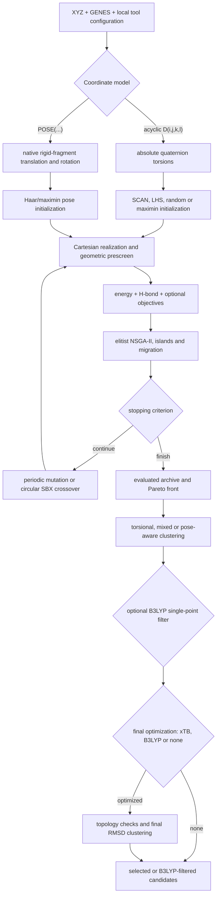
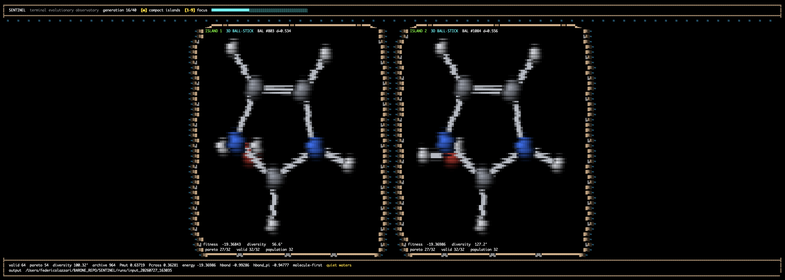

# SEEKER


SEEKER is a multi-objective heuristic explorer for rigid conformational and
inter-fragment configuration spaces. It keeps low-level single-point energy and
geometric hydrogen-bond fitness separate and uses NSGA-II to retain their
trade-offs.

SEEKER does **not** guarantee local minima on the potential-energy surface.
Its geometric scores are heuristic biases, not calibrated interaction
energies. Final candidates should be optimized and ranked with a suitable
electronic-structure method.

## Scientific workflow



The complete definitions, units, assumptions, biases, and implementation map
are in [Scientific workflow](docs/SCIENTIFIC_WORKFLOW.md). Operational details
are in the [usage guide](docs/USAGE.md).

## Install from a fresh clone

```bash
git clone git@github.com:Fiorderico/SEEKER.git
cd SEEKER
python3 --version  # must report 3.10 or newer
python3 -c 'import sys; assert sys.version_info >= (3,10), sys.version'
python3 -m venv .venv
. .venv/bin/activate
python -m pip install -e '.[discovery]'
seeker configure
seeker doctor
```

Do not use Apple's/Xcode's Python 3.9. If `python3 --version` reports 3.9 on
macOS, install a current interpreter and create the environment with it:

```bash
brew install python@3.13
"$(brew --prefix python@3.13)/bin/python3.13" -m venv .venv
. .venv/bin/activate
python -m pip install --upgrade pip
python -m pip install -e '.[discovery]'
```

Using `python -m pip` after activating the environment guarantees that pip and
Python belong to the same installation. Python 3.10 or newer is required. xTB
is the default energy backend. Coordinates are realized directly by SEEKER:
acyclic torsions use quaternion rotations and pose-only intermolecular inputs
use the native rigid-fragment kernel. Ring-puckering and mixed torsion/pose
coordinate sets are not supported. Gaussian (`g16` or `gdv`) is optional and
is used only for B3LYP post-processing. These programs remain external to this
repository.
The setup wizard stores their absolute paths in the ignored
`.seeker.local.toml`; a patched xTB build can be selected like any other
external executable.

## Quick start

The portable interactive entry point is:

```bash
./run_seeker.sh
# equivalent after installation
seeker launch
```

The launcher has a short guided path with coordinate-family presets and an
optional advanced path exposing initialization, islands and migration,
operators, prescreen thresholds, fitness objectives, early stopping,
clustering, backend controls, and generation snapshots. It finishes with a
review screen before creating any output. For xTB searches it can execute the
complete `search → clustering → optional B3LYP filter → xTB/B3LYP optimization
→ RMSD clustering` pipeline; executable paths come from the machine-local
configuration.

The guided preset is selected by a physical-coordinate decision tree rather
than raw scalar dimension: acyclic torsions and intermolecular `POSE` blocks
have separate evaluation budgets. The wizard shows
the selected branch and maximum nominal energy-evaluation count before launch.

`seeker run` and `seeker launch` always use native Cartesian realization.
Pose-only inputs use the vectorized rigid SE(3) kernel. Foreground mode shows the live TUI;
background mode writes `run.log` and `run.pid` in the run directory.

During interactive setup, every question is followed by a muted English hint
explaining its scientific or operational meaning and listing any allowed
answers. The wizard shows the always-active fitness objectives and every
available optional objective, with a short physical description and its
default state, before asking for the enabled optional set. On ANSI terminals
at least 80 columns wide, a molecular anthropomorphic seeker remains fixed
above rolling dunes while the questions scroll below it. Set `NO_COLOR=1` for
plain text; set `SEEKER_ANIMATION=0` to skip only the opening walk across the
dunes while keeping the static wizard decoration.

When the reference geometry contains a planar pi ring and an eligible N-H,
O-H, or S-H donor, the launcher proposes the `hbond_pi` objective with `yes` as
the default. Explicit `HPI_RING_...` directives in the GENES file are honored
by the same detection. Use `seeker launch --no-hbond-pi ...` to override the
recommendation.

The optional `hbond_=` objective targets N/O/S-H donors toward the midpoint of
automatically detected formal double bonds. Detection is performed once on the
reference XYZ from conservative element-specific bond-length windows; triple
and ordinary aromatic C-C/C-N bonds are excluded. The continuous score rewards
the donor-specific H-to-midpoint distance, a linear X-H...midpoint direction,
and approach near the perpendicular bisector of the double bond. Enable it
with `--extra-objectives 'hbond_='` (the aliases `hbond_double` and
`hbond_eq` are also accepted).

For intermolecular searches, the optional `disconnected_components_penalty` objective
discourages disconnected interaction subclusters. Its graph contains every
atom and every reference covalent bond, plus active hydrogen bonds and
geometrically possible X-H...pi/ring-center contacts in the current geometry.
The penalty is `number_of_connected_components - 1`, so any fully connected
network scores zero: a water chain is not penalized when it remains connected
to the rest of the system. It is disabled by default and can be enabled with
`--extra-objectives hbond_pi,disconnected_components_penalty`. The guided launcher
offers the feature with `no` as its default; for non-interactive launches use
`seeker launch --disconnected-components-penalty ...`.

## Live island dashboard

In foreground mode, an active search should look like this in a sufficiently
wide ANSI terminal:



Each island panel shows its current representative structure, fitness,
diversity, Pareto count, valid candidates, and population size. The top bar
reports generation progress and the current view; the footer summarizes the
combined archive, objective values, evolutionary probabilities, and output
directory. Use `[m]` to switch between overview and molecular gallery,
`[1-9]` to focus a specific island, and `[n]`/`[p]` to move between islands.

The exact arrangement adapts to the available terminal width and number of
islands, so molecule panels may be smaller or stacked on narrow terminals.
Run in foreground mode with `--tui` and use a terminal that supports ANSI
cursor control. When output is redirected, `--no-tui` is selected, or the
terminal lacks the required capabilities, SEEKER falls back to plain
progress output instead of this dashboard.

## Short tutorial: run the glycine example

### 1. Clone and create an isolated Python environment

```bash
git clone https://github.com/Fiorderico/SEEKER.git
cd SEEKER
python3 --version  # must be 3.10 or newer
python3 -m venv .venv
. .venv/bin/activate
python -m pip install --upgrade pip
python -m pip install -e '.[discovery]'
```

The environment is stored entirely in the local `.venv/` directory. It is not
global and is ignored by Git. Activate it again with
`. .venv/bin/activate` whenever you open a new terminal; `deactivate` leaves
it. Installing with `python -m pip` while it is active keeps SEEKER and its
Python dependencies inside that directory.
If `python3` is older than 3.10 on macOS, install a current Homebrew Python as
shown above and replace `python3` with its versioned command, such as
`python3.13`.

### 2. Configure programs installed on this machine

```bash
seeker configure
seeker doctor
```

Enter the xTB and Gaussian (`g16` or `gdv`) executable paths when requested.
Gaussian and Open Babel can be
skipped with `-` if they are not needed. The choices are saved in the ignored
`.seeker.local.toml`, so they are requested only once and are never
committed.

### 3. Validate the example without running xTB

```bash
seeker launch \
  --xyz examples/glycine/input.xyz \
  --genes examples/glycine/genes.txt \
  --output runs/glycine_validation \
  --validate-only --non-interactive --no-tui
```

This checks the XYZ file, genetic coordinates, charge, multiplicity, and
coordinate realization without evaluating energies.

### 4. Start the interactive search

```bash
./run_seeker.sh
# or, equivalently:
seeker launch
```

For the bundled example, answer approximately as follows:

```text
XYZ file: examples/glycine/input.xyz
GENES file: examples/glycine/genes.txt
Coordinate engine: native
New output directory: press Enter for runs/input_<timestamp>
Energy backend: xtb
Enabled optional fitness objectives: press Enter for the displayed set
Apply the recommended preset: yes
Open advanced scientific settings: no
Molecular charge: 0
Multiplicity: 1
Parallel workers: press Enter for the detected default
Random seed: 7
xTB method: gfn2
Apply a B3LYP single-point filter before optimization: no
Final optimization backend: xtb
Execution mode: foreground
Launch SEEKER: yes
```

The startup animation is followed by the live island dashboard. Its controls
are `[m]` for overview/gallery, `[1-9]` to focus an island, and `[n]`/`[p]` to
move between islands. Results are written only below the selected `runs/`
directory. With post-optimization enabled, the final structures are under
`postoptimization/optimized_xyz/` and the RMSD representatives under
`postoptimization/clustering/`.

To run the same defaults without questions:

```bash
seeker launch \
  --xyz examples/glycine/input.xyz \
  --genes examples/glycine/genes.txt \
  --output runs/glycine_gfn2 \
  --backend xtb --post-optimize --non-interactive
```

Validate an input without evaluating energy:

```bash
seeker run \
  --xyz examples/erythrulose/input.xyz \
  --genes examples/erythrulose/genes.txt \
  --output runs/erythrulose_validation \
  --validate-only
```

Run a small xTB search:

```bash
seeker run \
  --xyz examples/erythrulose/input.xyz \
  --genes examples/erythrulose/genes.txt \
  --output runs/erythrulose_gfn2 \
  --backend xtb --xtb-method gfn2 \
  --population 48 --offspring 48 --generations 40 \
  --islands 2 --migration-interval 10 --migration-size 4 \
  --workers 4 --seed 7 --tui
```

All generated data belongs under `runs/` or another ignored output directory.
The distributed examples contain only source inputs, short instructions, and
small reproducible launcher scripts—not scientific result archives.

## Coordinate and fitness capabilities

- Absolute acyclic torsions use rigid quaternion rotations.
- Ring-puckering coordinates are not supported.
- Rigid inter-fragment poses use the native batch kernel, with validation on
  S² and SO(3) before the genetic search.
- Energy backends are xTB, PySCF, or an external-command adapter. `external`
  is not a bundled electronic-structure method: it runs a user-supplied local
  command containing the `{xyz}` placeholder, then extracts the energy from
  its output with a configurable regular expression and unit.
- Always-active objectives are energy and geometric hydrogen bonding. Optional
  objectives cover N/O/S-H…π ring interactions, N/O/S-H interactions with
  double-bond centers (`hbond_=`), disconnected interaction penalties, and
  rotational descriptors.
- Final analysis supports periodicity cells, complete linkage, hybrid mixed
  coordinates, and permutation-aware pose/RMSD clustering for identical
  molecular fragments.

## Repository policy

Generated XYZ archives, logs, checkpoints, caches, optimization results,
reference collections, matching results, and benchmark runtime data are not
versioned. See [CONTRIBUTING.md](CONTRIBUTING.md) for the artifact policy.

## Copyright and reuse

This repository currently has **no software license**. Its availability does
not grant permission to copy, modify, redistribute, or incorporate the code
into another project. Contact the copyright holder before reuse.
