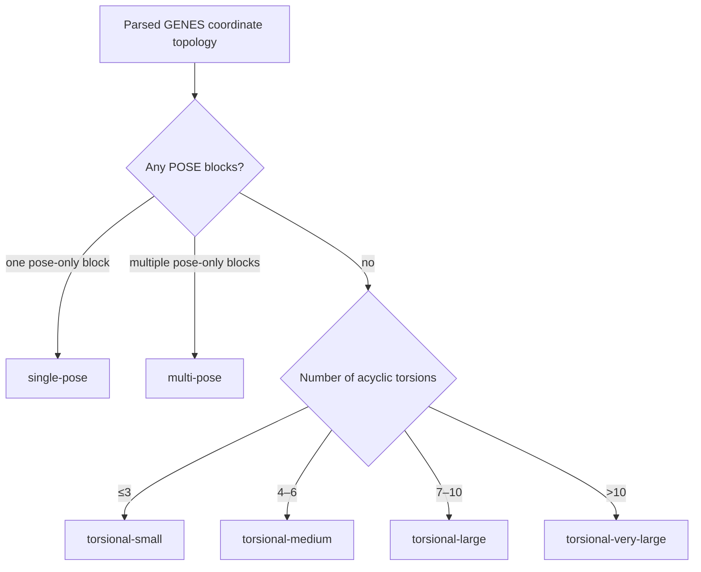

# Scientific workflow and implementation map

SEEKER explores candidate conformations; it is not a geometry optimizer and
does not prove that a candidate is a stationary point. Every objective is
minimized. Energy and geometric interaction scores remain separate Pareto
coordinates rather than being combined with arbitrary scalar weights.

## Coordinates and Cartesian realization

| Operation | Meaning and units | Assumptions and bias | Implementation |
|---|---|---|---|
| `D(i,j,k,l)` | Absolute dihedral angle in degrees, periodic over 360° | The central `j-k` bond must be acyclic. The side containing `l` moves rigidly. | `seeker.input`, `seeker.geometry` |
| Quaternion torsion | Rotates the moving fragment about the central bond | It cannot describe coupled deformation of a ring. | `seeker.geometry` |
| `POSE(...)` | Centroid distance in Å, direction on S², relative orientation on SO(3) | The first fragment is fixed and both fragments remain internally rigid. | `seeker.fragment_pose` |

All coordinates are realized directly inside SEEKER. POSE is never treated as
six unrelated scalar axes: direction is sampled on a spherical cap,
orientation with the Haar measure, interpolation with SLERP, and distance with
a normalized bounded metric. Ring-puckering coordinates and coordinate sets
that mix torsions with POSE blocks are not supported.

## Initialization and genetic operators

| Operation | Behavior | Statistical bias | Implementation |
|---|---|---|---|
| Random | Independent samples from each declared coordinate prior | Tracks prior density but may leave large holes | `seeker.operators` |
| Latin hypercube | Stratified samples transformed through each prior | Improves marginal coverage; does not guarantee joint maximin coverage | `seeker.operators` |
| Maximin | Selects the farthest genotypes from an oversized pool | Biases toward spread under the mixed periodic/bounded metric | `seeker.geometry`, `seeker.operators` |
| SCAN | Tensor or one-at-a-time deterministic coordinate grid | Tensor grids grow exponentially; one-at-a-time misses initially coupled moves | `seeker.operators` |
| Periodic mutation | Re-samples one torsion from its declared periodic prior | Periodicity is a sampling prior, not proof of molecular symmetry | `seeker.operators` |
| Circular SBX | Recombines parents along the shortest periodic arc | Favors children near parental arcs; `eta` controls locality | `seeker.operators` |

For a torsion with declared periodicity `n`, sampling uses the density recorded
in the run manifest. Genotype distance still spans 360° unless an independent
symmetry model establishes equivalence.

## Geometry checks and objectives

Candidates are rejected before expensive evaluation when they break expected
connectivity, generate excluded steric clashes, duplicate an existing genotype,
or fail coordinate realization.

| Objective | Quantity and units | Interpretation and bias | Implementation |
|---|---|---|---|
| Energy | Hartree internally | Depends on the selected backend and charge/spin settings | `seeker.backends` |
| H-bond | Dimensionless geometric score | Encourages plausible N/O/S hydrogen bonds but is not an interaction energy | `seeker.fitness` |
| Bifurcated H-bond | Dimensionless multi-acceptor extension | Can overemphasize selected bifurcated geometries | `seeker.fitness` |
| N/O/S-H…π | Dimensionless continuous geometric score | Ring perception and donor-specific widths define the bias | `seeker.fitness` |
| N/O/S-H…double bond | Dimensionless continuous geometric score | Rewards donor alignment with an automatically detected double-bond midpoint; element-specific reference bond-length windows and donor-specific widths define the bias | `seeker.fitness` |
| Novelty | Periodic genotype distance to neighbors | Rewards unexplored regions and is population-dependent | `seeker.objectives`, `seeker.engine` |
| Dipole/components | Debye when supplied by the charge model | Sensitive to approximate charges and axis conventions | `seeker.descriptors` |
| Rotational descriptors | Rotational constants and shape scores | Uses the rigid-rotor approximation | `seeker.descriptors` |

Activating many objectives weakens Pareto selection pressure. Start with energy
and H-bonding, then add objectives justified by the scientific question.

## Selection, islands, and stopping

NSGA-II ranks parents and offspring by nondomination and crowding distance.
Each island has an independent population and random stream. Synchronous ring
migration moves Pareto-diverse or random individuals; cached geometry and
fitness travel with migrants and are not recomputed.

The evaluated archive stores every valid, unique, evaluated candidate. Early
stopping combines objective stagnation with low genotype diversity; archive
stagnation is available separately.

## Analysis and post-optimization

Complete-linkage clustering applies mean and maximum circular torsional
thresholds. `periodicity_cells` assigns candidates to declared prior modes.
`hybrid` combines periodic cells, density clustering, and an energy graph.
`pose_hybrid` embeds radius, S² direction, and sign-invariant SO(3) rotation.
Repeated graph-isomorphic fragments can be exchanged during pose and RMSD
comparison so solvent-label permutations do not consume extra candidate slots.

An optional fixed-level B3LYP single-point stage can re-rank selected candidates
before geometry optimization. Final optimization may use xTB, B3LYP, or be
skipped. SEEKER aligns each optimized geometry to its source, checks topology,
and performs complete-linkage RMSD clustering.

## First-run preset decision tree

The launcher classifies the physical coordinate family instead of treating all
scalar dimensions as equivalent.

These are balanced first-run budgets, not convergence guarantees. Production
claims should compare multiple seeds and increase the budget while new
low-energy basins continue to appear.
